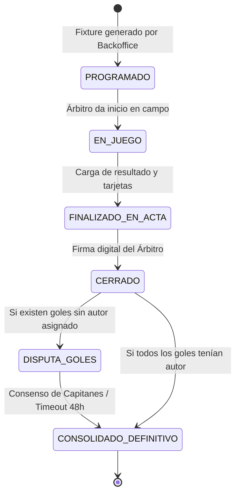
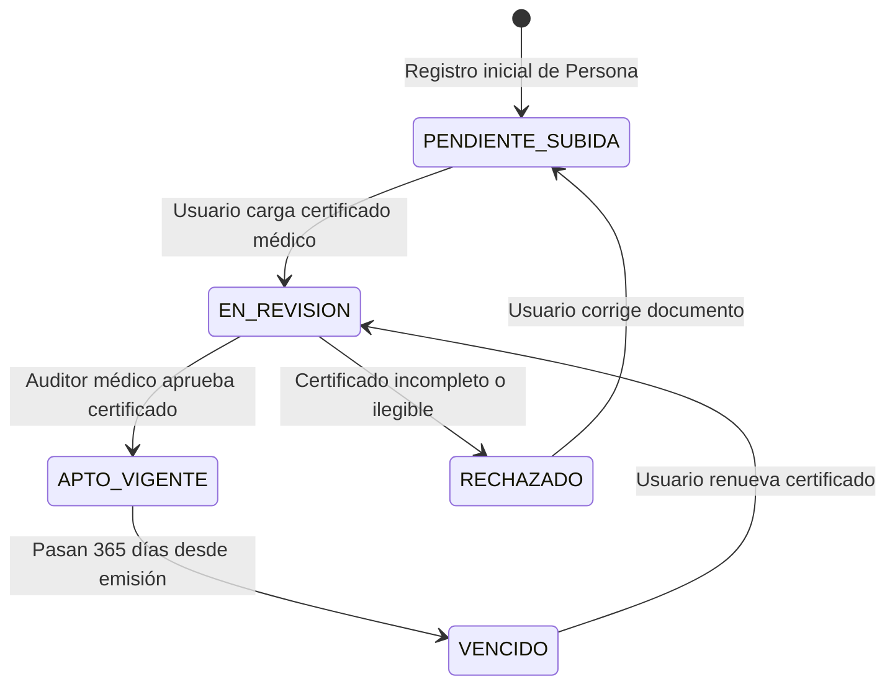
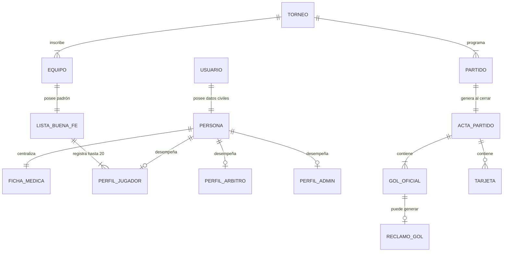

# ⚽ DOCUMENTO DE ANÁLISIS FUNCIONAL Y ESPECIFICACIÓN DE REQUISITOS (SRS)
## Sistema: CanchaPro Suite (Ecosistema Dual)
**Estándar IEEE 830 / RUP Adaptado para Co-Diseño con IA**

---

> [!NOTE]
> **Ficha Técnica del Análisis Funcional:**
> * **Asignatura:** Inteligencia Artificial para Programadores (Loop Coding - Unidad 4)
> * **Proyecto:** **CanchaPro Suite**
> * **Versión del Documento:** 3.5 (Edición Académica Definitiva)
> * **Autor:** Joaquín Frattin
> * **Alcance:** Especificación Funcional, Matriz de Actores, Catálogo de Reglas de Negocio (RN-01 a RN-13), Especificación de Casos de Uso con Flujos Alternativos y Diccionario de Datos.

---

## 📑 Índice de Contenidos
1. [Visión General y Alcance del Producto](#1-visión-general-y-alcance-del-producto)
2. [Matriz de Actores y Perfiles de Usuario](#2-matriz-de-actores-y-perfiles-de-usuario)
3. [Catálogo Formal de Reglas de Negocio (RN-01 a RN-13)](#3-catálogo-formal-de-reglas-de-negocio)
4. [Especificación Detallada de Casos de Uso (Flujos Principal, Alternativo y Excepciones)](#4-especificación-detallada-de-casos-de-uso)
5. [Diagramas de Máquinas de Estado del Dominio](#5-diagramas-de-máquinas-de-estado)
6. [Diccionario de Datos y Modelo de Entidades](#6-diccionario-de-datos)
7. [Matriz de Trazabilidad de Requisitos](#7-matriz-de-trazabilidad)

---

<a name="1-visión-general-y-alcance-del-producto"></a>
## 1. Visión General y Alcance del Producto

### 1.1 Declaración del Problema
En el fútbol amateur y la gestión de complejos deportivos persisten 4 dolores operativos críticos:
1. **Suplantación de identidad y jugadores inhabilitados:** Equipos que incluyen personas no federadas, sin cobertura médica ni seguro deportivo.
2. **Desarticulación en la comunicación de partidos:** Jugadores que no disponen de un canal oficial para conocer su rival, horario exacto, cancha y árbitro designado.
3. **Disputas en actas y tablas de goleadores:** Goles mal anotados por el árbitro en jugadas dudosas que generan fricción entre capitanes y comisiones organizadoras.
4. **Pérdida de historial deportivo:** Torneos pasados archivados en planillas físicas o archivos Excel sin conexión con las cuentas de los jugadores actuales.

### 1.2 Propuesta de Solución: Ecosistema Dual CanchaPro
CanchaPro resuelve esta problemática dividiendo la solución en dos aplicaciones complementarias:
* **📱 CanchaPro App Móvil (Android / Google Play Store):** Interfaz ágil para Jugadores, Capitanes de Equipo y Árbitros en campo de juego.
* **💻 CanchaPro Backoffice Web (Desktop):** Panel administrativo de alta densidad para Organizadores de Torneos y Dueños de Complejos.

---

<a name="2-matriz-de-actores-y-perfiles-de-usuario"></a>
## 2. Matriz de Actores y Perfiles de Usuario

| Actor | Descripción y Responsabilidad | Aplicación / Entorno |
| :--- | :--- | :--- |
| **👔 Administrador / Organizador** | Crea y parametriza torneos, sedes, canchas, categorías y cupos. Genera fixtures y audita listas de fe. | Backoffice Web Desktop |
| **🛡️ Capitán / Responsable** | Crea el equipo, inscribe el plantel en torneos abiertos, gestiona la Lista de Buena Fe (20 jugadores) y realiza la convocatoria de los 11 titulares del domingo. Resuelve disputas de goles. | App Móvil Android |
| **🏃 Jugador / Usuario** | Persona registrada con ficha médica vigente. Consulta "Tu Próximo Partido", estadísticas individuales y tabla de posiciones. | App Móvil Android |
| **⚖️ Árbitro Oficial** | Juez matriculado asignado al partido. Valida planillas de 11 jugadores, carga goles/tarjetas y firma el acta digital cerrando el encuentro. | App Móvil (Modo Árbitro) |
| **🩺 Auditor Médico** | Profesional de la salud o personal administrativo que aprueba los certificados de Apto Físico cargados por las personas. | Backoffice Web Desktop |

---

<a name="3-catálogo-formal-de-reglas-de-negocio"></a>
## 3. Catálogo Formal de Reglas de Negocio

```text
┌─────────────────────────────────────────────────────────────────────────────┐
│                    CATÁLOGO DE REGLAS DE NEGOCIO (RN)                       │
├─────────┬───────────────────────────────┬───────────────────────────────────┤
│ CÓDIGO  │ NOMBRE DE LA REGLA            │ INVARIANTE / CONDICIÓN DE CORTE   │
├─────────┼───────────────────────────────┼───────────────────────────────────┤
│ RN-01   │ Patrón Trinidad de Identidad  │ 1 Usuario ↔ 1 Persona ↔ N Roles   │
│ RN-02   │ Apto Médico Obligatorio       │ Vigencia 365 días (Bloqueo autom.)│
│ RN-03   │ Parametrización de Torneos    │ Sedes, Canchas, Cat, Cupos        │
│ RN-04   │ Inscripción y Capitán         │ 1 Capitán Persona responsable     │
│ RN-05   │ Lista de Buena Fe Oficial     │ Padrón de hasta 20 jugadores      │
│ RN-06   │ Convocatoria de Partido (11)  │ Exacto 11 titulares inscriptos    │
│ RN-07   │ Fixture Inteligente           │ Asignación sin solapamiento       │
│ RN-08   │ Designación Arbitral          │ 1 Árbitro matriculado por partido │
│ RN-09   │ Cierre de Acta Digital        │ Marcador, tarjetas, pase a CERRADO│
│ RN-10   │ Consenso de Goles Sin Dueño   │ Reclamo + Fair Play + Timeout 48h │
│ RN-11   │ Cómputo de Tablas en Vivo     │ PTS (3-1-0), GF, GC, DG, Goleador │
│ RN-12   │ Lazy Linking por DNI          │ Sincronización histórica Excel    │
│ RN-13   │ Reserva de Canchas y Seña     │ Bloqueo preventivo de turnos      │
└─────────┴───────────────────────────────┴───────────────────────────────────┘
```

### Detalle de Reglas Clave:
* **RN-06 (Convocatoria Estricta):** El sistema impide guardar la planilla de citación si la cantidad de jugadores seleccionados difiere de 11 o si algún jugador posee apto vencido o no figura en la Lista de Buena Fe del torneo.
* **RN-10 (Goles Sin Dueño y Consenso Fair Play):**
  1. *Condición de Origen:* En el acta cerrada por el árbitro existen $N$ goles oficiales pero solo $K$ autores identificados ($K < N$).
  2. *Reclamo:* El capitán del equipo beneficiado asigna el gol vacante a un jugador de su lista de fe.
  3. *Validación Rival:* El capitán del equipo contrario recibe la solicitud para Aprobar o Rechazar.
  4. *Timeout de 48 Horas:* Si el rival no responde en 48 horas, el sistema auto-aprueba el reclamo.
  5. *Invariante Estricto:* La suma de goles asignados jamás puede superar la cantidad oficial convalidada por el árbitro.
* **RN-12 (Lazy Linking por DNI):** Los datos cargados desde el archivo `Año 2003.xlsx` permanecen como perfiles de `Persona` pendientes. Al momento en que un usuario se registra con su DNI, el sistema transfiere de forma atómica sus 23 partidos y goles históricos a su nueva cuenta.

---

<a name="4-especificación-detallada-de-casos-de-uso"></a>
## 4. Especificación Detallada de Casos de Uso

### 📌 Caso de Uso CU-01: Crear y Publicar Torneo
* **Actor Principal:** 👔 Administrador de Torneos (Backoffice Web).
* **Precondición:** El administrador ha iniciado sesión en el Backoffice.
* **Flujo Principal:**
  1. El Administrador selecciona `+ Crear Nuevo Torneo`.
  2. Ingresa: Nombre del Torneo (*ej: Torneo Clausura 2026*), Sede (*ej: Palermo Central*), Canchas habilitadas (*ej: Cancha 1, Cancha 2*), Categoría (*ej: Libre División A*) y Cupo Máximo (*ej: 16 equipos*).
  3. El sistema valida que las canchas pertenezcan a la sede seleccionada.
  4. El sistema publica el torneo en estado `INSCRIPCIONES_ABIERTAS`.
* **Flujos Alternativos:**
  * *4a. Cupo inválido (< 4 equipos):* El sistema emite alerta y solicita corregir el valor.
* **Postcondición:** El torneo queda visible en la App Móvil para que los capitanes inscriban sus equipos.

---

### 📌 Caso de Uso CU-06: Registro de Usuario con Patrón Trinidad y Lazy Linking
* **Actor Principal:** 🏃 Jugador / Capitán / Árbitro (App Móvil).
* **Precondición:** Ninguna.
* **Flujo Principal:**
  1. El usuario abre la App Móvil y selecciona la pestaña `Registrarse`.
  2. Ingresa Email, Contraseña, Nombre, Apellido, DNI, Grupo Sanguíneo y Contacto de Emergencia.
  3. El sistema crea la entidad `Usuario` (credenciales) y la entidad `Persona` (datos civiles + ficha médica).
  4. **Evaluación de Lazy Linking:** El sistema consulta si el DNI existe en el padrón histórico (`Año 2003.xlsx`).
  5. *Coincidencia Positiva:* El sistema vincula automáticamente los 23 partidos jugados y goles históricos al nuevo `PerfilJugador` y emite notificación de bienvenida personalizada.
  6. El usuario ingresa al Dashboard de la app.
* **Postcondición:** El usuario cuenta con sesión activa y ficha médica unificada.

---

### 📌 Caso de Uso CU-08: Gestión de Lista de Buena Fe
* **Actor Principal:** 🛡️ Capitán de Equipo (App Móvil).
* **Precondición:** El equipo está inscripto en un torneo activo.
* **Flujo Principal:**
  1. El Capitán navega a la pestaña `Lista de Fe`.
  2. Presiona `+ Agregar Jugador` e ingresa Nombre, DNI y Dorsal del jugador.
  3. El sistema verifica que el jugador no esté inscripto en otro equipo dentro de la misma categoría del torneo.
  4. El sistema añade al jugador al padrón oficial del equipo (máximo 20).
* **Postcondición:** El jugador queda habilitado para ser convocado en los partidos del torneo.

---

### 📌 Caso de Uso CU-09: Convocatoria Oficial de Partido (11 Titulares)
* **Actor Principal:** 🛡️ Capitán de Equipo (App Móvil).
* **Precondición:** Existe un partido programado en el fixture oficial.
* **Flujo Principal:**
  1. El Capitán visualiza la tarjeta `"Tu Próximo Partido"` y selecciona `Citar los 11 Titulares`.
  2. El sistema lista los 20 jugadores de su Lista de Buena Fe con su estado médico (*Apto OK / Apto Vencido*).
  3. El Capitán marca los checkboxes de los 11 jugadores que asistirán el domingo.
  4. El Capitán presiona `Confirmar Planilla Oficial`.
  5. El sistema valida:
     * Cantidad exacta de 11 jugadores seleccionados.
     * Ningún jugador seleccionado posee el apto médico vencido.
  6. La convocatoria queda consolidada y se transmite a la terna arbitral.
* **Flujos Excepcionales:**
  * *5a. Selección menor o mayor a 11:* El sistema bloquea el envío indicando: *"Debes convocar exactamente 11 jugadores"*.
  * *5b. Intento de citar jugador con Apto Vencido:* El sistema deshabilita el checkbox y resalta la advertencia en rojo.

---

### 📌 Caso de Uso CU-10: Cierre de Partido y Firma de Acta Digital
* **Actor Principal:** ⚖️ Árbitro Oficial (App Móvil - Modo Árbitro).
* **Precondición:** El partido ha finalizado en campo de juego.
* **Flujo Principal:**
  1. El Árbitro accede al partido en su panel arbitral.
  2. Carga el marcador final oficial (*ej: Galácticos FC 3 - 1 Inter Palermo*).
  3. Registra tarjetas amarillas y rojas con minuto y dorsal.
  4. Asigna los autores de los goles que identificó (*ej: 2 goles asignados*).
  5. Presiona `Cerrar Partido y Firmar Acta Digital`.
  6. El sistema cambia el estado del partido a `CERRADO`, actualiza la Tabla de Posiciones y, si existen goles sin autor, genera una alerta de *Gol Sin Dueño*.
* **Postcondición:** El partido no puede ser modificado y el resultado es oficial.

---

### 📌 Caso de Uso CU-11: Protocolo de Reclamo y Consenso de Goles Sin Dueño
* **Actor Principal:** 🛡️ Capitán Beneficiado y 🛡️ Capitán Rival (App Móvil).
* **Precondición:** El partido fue cerrado con goles sin autor asignado.
* **Flujo Principal:**
  1. El Capitán del equipo beneficiado visualiza el banner: *"1 Gol Sin Dueño Detectado"*.
  2. Presiona `Asignar Gol a Jugador` y selecciona al autor de su Lista de Buena Fe (*ej: #11 Carlos Feliciano*).
  3. El sistema crea la solicitud de reclamo con un temporizador de 48 horas y envía notificación push al Capitán Rival.
  4. El Capitán Rival abre el modal de `Validación Fair Play` y presiona `Aprobar Gol`.
  5. El sistema acredita el gol a Carlos Feliciano en la Tabla Oficial de Goleadores.
* **Flujos Alternativos:**
  * *4a. Expiración de Timeout (48 horas):* Si el Capitán Rival no responde en 48 hs, el sistema auto-aprueba el reclamo y acredita el gol.
  * *4b. Rechazo por Capitán Rival:* El reclamo pasa a estado `EN_DISPUTA_TRIBUNAL` para resolución por la organización.
* **Invariante:** En ningún caso se permite reclamar más goles que los convalidados por el árbitro en el marcador oficial.

---

<a name="5-diagramas-de-máquinas-de-estado"></a>
## 5. Diagramas de Máquinas de Estado

### 5.1 Ciclo de Vida de un Partido



### 5.2 Ciclo de Vida de la Ficha Médica



---

<a name="6-diccionario-de-datos"></a>
## 6. Diccionario de Datos y Modelo de Entidades



---

<a name="7-matriz-de-trazabilidad"></a>
## 7. Matriz de Trazabilidad de Requisitos

| Requisito de Negocio | Caso de Uso Asociado | Reglas de Negocio Involucradas | Componente en Arquitectura |
| :--- | :--- | :--- | :--- |
| **Identidad Unificada y Ficha Médica** | CU-06: Registro Trinidad | RN-01, RN-02, RN-12 | App Móvil (`app_mobile.html`) / Auth Service |
| **Creación y Gestión de Torneos** | CU-01: Publicar Torneo | RN-03, RN-07 | Backoffice Web (`backoffice_admin.html`) / Tournament Svc |
| **Lista de Buena Fe y Convocatorias** | CU-08, CU-09: Plantel y Citación | RN-05, RN-06 | App Móvil / Squad Svc |
| **Cierre de Actas y Resultados** | CU-10: Cierre por Árbitro | RN-08, RN-09, RN-11 | App Móvil (Modo Árbitro) / Match Svc |
| **Resolución de Goles Sin Dueño** | CU-11: Consenso Fair Play | RN-10 | App Móvil / Dispute & Fair Play Engine |
| **Carga de Historial Excel 2003** | CU-04: Importar Excel | RN-12 | Backoffice Web / Excel Parser Engine |
